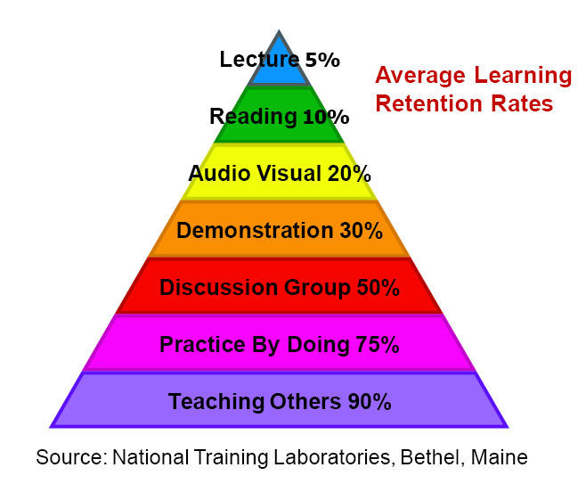

Reflection
Consider the “learning pyramid as shown in the image below. Do you find that matches the way that you learn, or would you weight the activities differently? If so, how?

Learning Pyramid

The biggest lessons from today were about initializing local storage (seeding) with data from our product file, and then using that local storage for not only the product page to reference, but also the cart.  And we created an admin page where an admin user can add items to the local storage.  This is a precursor to the idea of using a SQL database to store and access data, and I'm really excited to learn more about how these things work.

As far as the pyramid goes, I would just switch the reading and lecture.  I feel I learn more from a lecture than reading generally -- especially if there's time at the end to ask questions and go back and forth.
